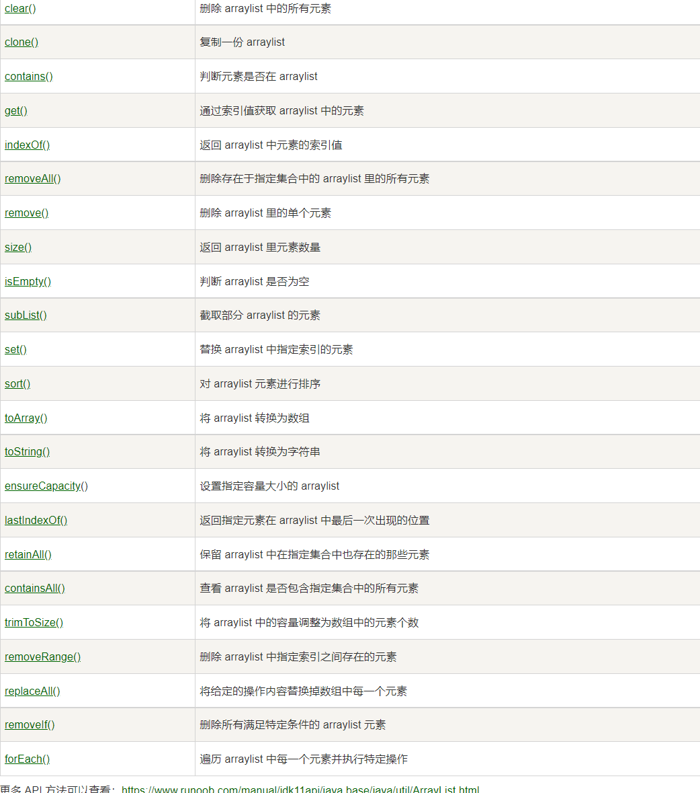

2021-11-03 20:52:43

## ArrayList 类

ArrayList 类是一个可以动态修改的数组，与普通数组的区别就是它是没有固定大小的限制，我们可以添加或删除元素。

ArrayList 继承了 AbstractList ，并实现了 List 接口。

```
import java.util.ArrayList; // 引入 ArrayList 类

ArrayList<E> objectName =new ArrayList<>();　 // 初始化
```

- **E**: 泛型数据类型，用于设置 objectName 的数据类型，**只能为引用数据类型**。
- **objectName**: 对象名。
- 数据索引从0开始
- 

![image-20211106151011606](../noteimages/java语法.images/image-20211106151011606.pn

