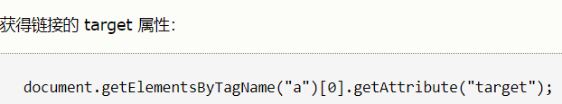
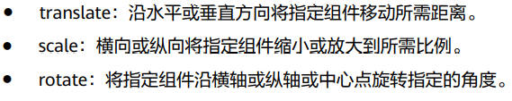
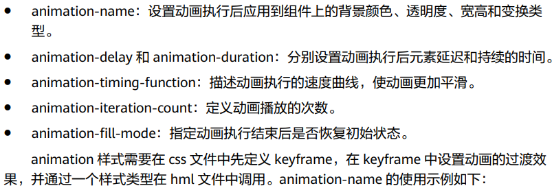

[TOC]

# 鸿蒙JS

## html

1. getAttribute() 方法返回指定属性名的属性值

## css

## 页面路由

注册表手动增加页面

`rouer.push`

| 参数   | 类型   | 标注                                                         |
| ------ | ------ | ------------------------------------------------------------ |
| url    | string | 目标页面的uri                                                |
| params | object | 传递过去的数据 如this.data1(data1为跳转时params参数中的key值) |

## 动画

**transform** 静态动画 

translateX（200px） 右移200px

**animation** 连续动画 颜色 透明度和宽度变化

## 正则表达式

+ `\d+` 一个以上数字

# ability

## 调用FA调用Java PA机制

提供了一种通道来传递方法调用、数据返回、事件上报

快速完成FA调用PA应用的开发。开发者只需添加简单的配置与标注即可利用该工具完成大部分FA调用PA模板代码的编写

配置的build.gradle文件是entry是，否则调用不了注解的包；

build需要sdk目录下toolchains->restool.exe才能运行

## 调用PA

## 分布式备忘录示例

