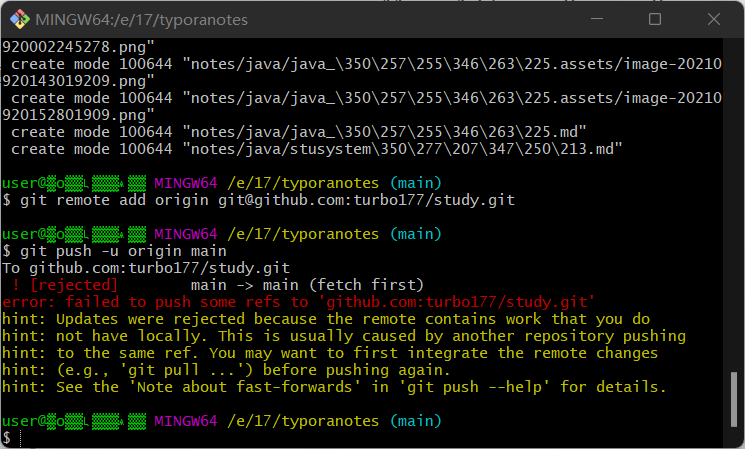

# git clone

# git 

1. git push
2. git commit -m "message"
3. git add.

 gitpush使用https://www.cnblogs.com/du-hong/p/9921214.html

git配置sshhttps://blog.csdn.net/u013778905/article/details/83501204

