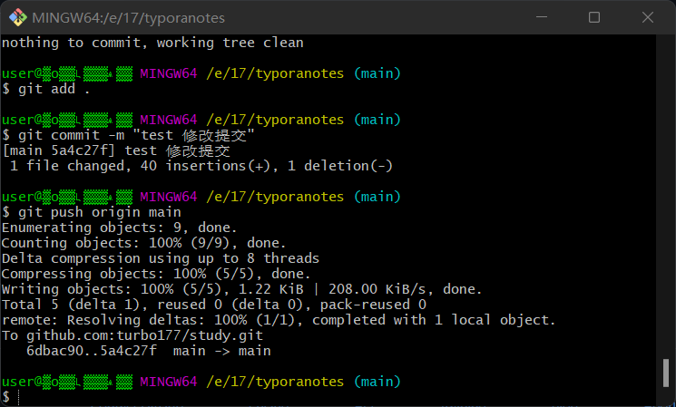
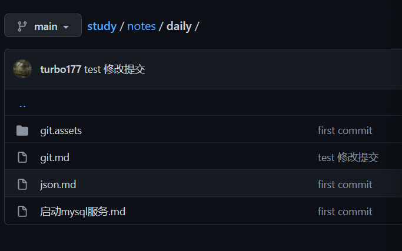

# git clone

# git 

1. git push
2. git commit -m "message"
3. git add.

 gitpush使用https://www.cnblogs.com/du-hong/p/9921214.html

git配置sshhttps://blog.csdn.net/u013778905/article/details/83501204

# git出错记录

+ 初始化 讲文件夹设为可以操作的本地仓库

  

+ 切换到main

+ add .

+ commit

+ 

+ git remote 关联github仓库

+ 

+ 第一次尝试git push

+ 

+ 查原因为本地与远程产生冲突，尝试将仓库clone下再进行上传

  

+ 解决：先把远程的变化拉取下来，再一并提交

  
  
+ 结果

  

  

  

  参考文档[提交代码报错 error: failed to push some refs to - 云+社区 - 腾讯云 (tencent.com)](https://cloud.tencent.com/developer/article/1773434)
  
+ 测试修改提交

  

+ 仓库内md文件提交成功，图片文件夹未成功

  

+ 加入了picgo上传图片方式来存储

用deveco push的时候报SSL那个错，cmd执行`git config --global http.sslVerify "false"`

但每次都弄真的很麻烦
