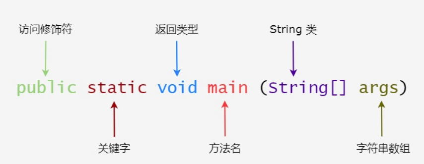

Java程序中最基本的组成单位是类，类的定义格式：

```
public class 类名 {

}//class定义结束
//public用来修饰字段的，表示这个字段可以被外部访问
```

# 基本语法

### 变量

1. 变量名不能重复
2. 变量未赋值，不能使用
3. long类型的变量定义的时候，为了防止整数过大，后面加L
4. float类型的变量定义的时候，防止类型不兼容，后面加F

##### 数据类型

+ 整数类型 byte short int long

+ 浮点数类型 float double           -判断浮点数用`==`不好，会有误差；正确方法是利用差值小于某个临界值来判断！

  ```
   double x = 1 - 9.0 / 10;
          if (Math.abs(x - 0.1) < 0.00001){
          
          }
  ```

  

+ 字符类型 char  用单引号 ，与用双引号的字符串类型区分开

+ 布尔类型 boolean

+ 引用类型 最常用String字符串 类似于c指针

+ 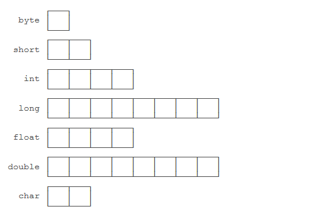

##### 运算

+ 移位运算：二进制表示

  ```
  int n = 7;
  int a = n << 1;//14
  int b = n << 29;//最高位变为1，结果变成了负数
  ```

  1. 对负数进行右移，最高位1不动，结果仍是负数；

  2. 无符号右移运算`>>>`

     ```
     int n = -536870912;
     int a = n >>> 31;//1
     ```

  3. 左移不断×2，右移÷2；

##### 字符串

+ 不可变性

  ```
  String s = "hello";
          System.out.println(s); // 显示 hello
          s = "world";
          System.out.println(s); // 显示 world
  ```

  变得不是字符串s，是变量s的“指向”

+ null和空字符串`""`不同，

##### 数组

+ 定义：`int[] //数组类型“类型[]”`,初始化用`new int[5] //可容纳5个int元素`；
+ 初始化都为默认值，数组一旦创建，大小不可改变；
+ 访问索引从0开始；
+ 和字符串类似，也是相当于“指向”一个数组，如果改变数组并不变，而是变量的“指向”变了；

##### if

+ 判断引用类型的变量内容相等，`equals()`

  ```
  if(s1.equals(s2)) {
  //如果变量s1为null，会报NullPointerException,避免报错需要短路运算符&&
  }
  //修改为：
  if(s1 != null && s2) {
  
  }
  
  ```

##### switch

+ 新语法`->`,如果有多条语句，需要用`{}`括起来，不写break，新语句没有穿透效应。
+ yield：需要复杂的语句可以写到{...}里，然后用yield返回一个值作为switch语句的返回值。
+ 结束必须有；

##### for循环

+ for each 遍历数组，循环的变量n不是计数器，是直接拿到对应元素

+ Java标准库提供了`Arrays.toString()`,打印数组内容

  ```
  import java.util.Arrays;
  
  public class Main {
      public static void main(String[] args) {
          int[] ns = { 1, 1, 2, 3, 5, 8 };
          System.out.println(Arrays.toString(ns));
      }
  }
  
  ```

##### 数组排序

1. 冒泡排序
2. 标准库内置`Arrays.sort()`进行排序，使用后数组内容被改变，

##### 二维数组

1. 访问某个元素：`array[row][col]` 
2. Java标准库 `Aeeays.deepToString()`

##### 命令行参数

Java程序的入口是main方法，main可以接受一个命令行参数，是一个String[]数组；

### 面向对象

+ 通过对象的方式，把现实世界映射到计算机模型的一种编程方法；

##### 基本概念

Java代码由不同功能的类，class由属性（类中的成员变量）和行为（类中的成员方法），关键在类！

##### 创建

1. 编写类

   ```
   修饰符 class 类名 {//类首字母大写
   //属性，成员变量，可以先声明不用初始化，有默认值；
   //行为，方法，驼峰命名，首个单词首字母小写，其他单词首字母大写；
   }
   ```

2. 创建实例

   new操作符 `Person ming  = new Person();` 定义Person类型的实例，通过变量ming指向它，是引用变量；

   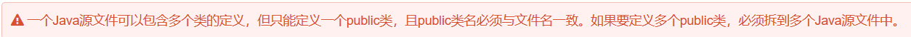
   
3. 成员变量 局部变量 

   static 静态 这样的变量不需要类实例化 直接通过类名.属性直接调用，即类变量；

   实例变量只能在类实例化后的对象中使用

   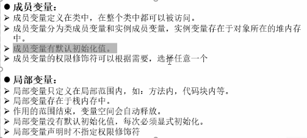

##### 方法 类 对象

   1. 引用传递：`Person per2 = per1;` 将per1对象堆内存的地址赋值给per2，相当于两个不同的栈内存都指向了同一块堆内存空间；
   
      或者用方法实现引用传递；
   
   2. 构造方法：构造方法实现实例初始化，①构造方法的名称和类名称一致；②构造方法不允许又返回值类型声明；③一个类中至少存在一个构造方法；④构造方法也可重载；
   
   3. 方法重载：一个类中定义多个同名方法，方法的参数个数或者参数数据类型不一样；方法重载的返回值类型通常都是相同的；

      **ps**：编写顺序按参数个数升序或降序；类中编写顺序：成员属性→定义构造方法→定义普通方法；

   4. Java里方法的参数传递方式只有一种：值传递；

   5. this：

      ① 调用本类属性：调用类中成员属性都用“this.属性”方式来表示

      ② 调用本类方法：调用本类普通方法：this.方法()

      ​								调用本类构造方法：this()；只能放在构造方法首行使用 ；

      ​								表示当前对象：

   6. static：

      ​	① static属性：用于声明程序结构的关键字，可用于全局属性和全局方法的声明；可以在实例化对象的时候调用；

      ```
      //main方法中
      System.out.println("直接访问static属性："+ Chinese.country);
      Chinese.country = "中国中国";//在Chinese类中定义的语句是：static String country = "初始的中国";
      //输出的结果：直接访问static属性：初始的中国；
      			（其他的属性值） 中国中国；
      ```

      ​	②static定义方法：
      
   7. 代码块 ：①普通代码块可以将一个方法中的代码进行部分分割；②静态代码块使用static，只执行一次，可进行一些公共的初始化；③静态优先于构造代码块优先于构造方法

### 继承

##### 定义

1. `class 子类 extends 父类 {}`（子类为派生类，父类为超类）
2. 子类可以继续重用父类中定义的属性和方法；

##### super

1. 在子类中明确调用父类的无参构造，super()只能在子类的构造方法中定义，必须放在子类构造方法的首行；

##### 继承限制

1. 一个子类只能继承一个父类；Java之中允许多层继承，不允许多重继承；
2. 在继承的时候实际上会继承父类的所有操作即可以直接利用对象操作，但是对于所有非私有属于显式继承，对于private属于隐式继承即间接完成；

##### 覆写

1. 方法覆写：用super().方法调用父类中已经被覆写过的方法； super调用时直接找父类，this会找本类，没有再找父类；
2. 
3. 限制：private<default<public，子类权限需大于父类权限；**但父类方法定义private，子类无法覆写此方法**
4. 属性覆盖：子类中定义了与父类名称相同的属性，子类中调用父类属性用super.属性；
5. **this和super调用构造方法必须都放在构造方法的首行！**

##### final

1. 使用final定义的类不能有子类； `final class Channel {}`
2. 使用final定义的方法不能被子类覆写；`public final void connect() {}`
3. 使用final定义常量；`private final int ON = 1;`
4. 定义全局常量；`public static final int ON = 1;`

##### 多态性

1. 对象向上转型：把一个子类型安全地变为更抽象的父类型；不需要关心对象的声明类型，**关键在于实例化新对象时所调用的那个子类的构造**  ，实现方法接收或返回参数类型的统一；
2. 一旦向上转型，父类对象无法直接调用类扩充方法；
3. 对象向下转型：把一个父类类型强制转型为子类类型；
4. 报ClassCastException：父类强转为子类，扩充功能却无法凭空变出来，需要instanceof；**必须先向上转型，再向下转型，确保有关系**

##### instanceof

1. 实例类型判断  `对象 instanceof 类`，返回true表示实例是指定类对象；**null的实例判断返回false**

2. 向下转型前先判断：

   ```
   Person p = new Student();
   if (p instanceof Student) {
       // 只有判断成功才会向下转型:
       Student s = (Student) p; // 一定会成功
   }
   //另一个更简单用法例子
   if (obj instanceof String s) {
   // 可以直接使用变量s:
   System.out.println(s.toUpperCase());
   }
   ```

##### object类

1. 是所有类的父类，所有类的对象都可以向上转型为object类对象实例化；当某些操作方法需要接收任意类型数据，object最适合；

2. 获取对象信息：覆写`toString()`方法

   ```
    public String toString() {
           return "Person:name=" + name;
       }
   ```

3. 对象比较：`equals()`

   ```java
   public boolean equals(Object o) {
           // 当且仅当o为Person类型:
           if (o instanceof Person) {
               Person p = (Person) o;
               // 并且name字段相同时，返回true:
               return this.name.equals(p.name);
           }
           return false;
       }
   ```

4. 计算哈希值：`hashCode()`

   ```java
   public int hashCode(){
   return this.name.hashCode();
   }
   ```


### 抽象类

##### abstract

1. 父类的方法本身不需要实现任何功能，仅仅是为了定义方法签名，目的是让子类去覆写它，那么，可以把父类的方法声明为抽象方法-----没有具体执行代码

   ```java
   abstract class Person(){
   public abstract void run();
   }
   ```

2. 无法实例化抽象类

3. 面向抽象编程：尽量引用高层类型，避免引用实际子类型的方式；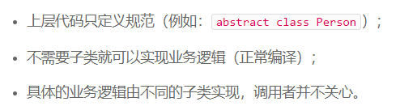

##### 包装类


**继承是一个 "是不是"的关系，而 接口 实现则是 "有没有"的关系**

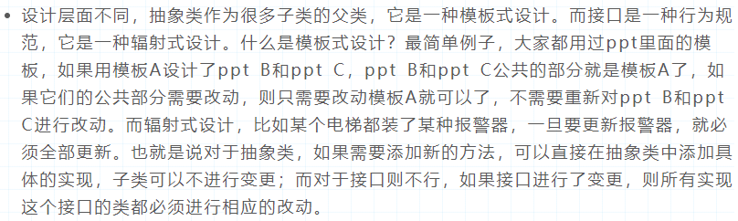

### 接口

##### 定义interface

1.  ```java
    interface IMessage {
        public static final String INFO = "www.com";
        public abstract String getInfo();//抽象方法
    }
    ```

2. implements 实现多个父接口

```java
class MessageImpl implements IMessage {//实现接口
//多个父接口例如 class MessageImpl implements IMessage,IChannel
    public String getInfo() {
        return "huoquxinxi";
    }
}
public class Jiekou {
    public static void main(String[] args) {
        IMessage msg = new MessageImpl();//子类实例化父接口
        System.out.println(msg.getInfo());//调用方法
    }
}
```

3. 利用抽象类可以实现公共方法的定义，利用extends先继承父类再利用implements实现若干父接口的顺序完成子类定义；
4. extends继承多个父接口
5. default  接口中的组成不在只有抽象方法，default定义的普通方法也能被子类直接继承；且必须通过实例化对象调用；
6. static 可以直接利用接口名称调用；可用来获取接口实例化对象；

### 包

1. 主要目的是将不同功能的文件进行分割； `package`定义包名称；`.`表示子目录；
2. 有包结构存在，写完整 包.类名称；

##### 包的导入

1. 包中的类彼此之间存在相互调用的关系，使用`import`导入被调用的程序类；
2. class声明的类只能在同一个包中使用，调用需要定义为public class；**一个java文件只能由一个public class ，想要被外部访问需定义为public**；
3. `import 包.*`导入和单独导入是一样的；但不好分辨类属于哪个包；
4. 核心类使用java.lang包，编译器自动导入；

##### 静态导入

##### jar文件

提供自己的压缩文件jar

##### protected

1. 只允许被包和不同包子类所访问；


###  异常处理
<hr/>
异常被try语句捕获，交给catch进行处理；利用finall代码块作为程序的执行出口，不管代码种是否出现异常都会执行此代码；

##### printStackTrace()方法

输出异常信息

发生异常时回产生异常的实例化对象，可以自动向父类转型，实际上所有的异常都可以使用`Exception`来处理；

处理多个异常，捕获范围小的放在大的之前处理；

##### throws关键字

1. 涉及到类方法调用，在声明时需要对可能出现的异常进行标记；
2. 主方法没有编写相应的异常处理语句，最终会交由JVM默认进行处理。主方法往往是程序的起点，所有的异常应该在主方法中全部处理完成，而不应该向上抛出；
3. 在方法定义中使用，表示此方法中可能产生的异常明确告诉调用处，由调用处处理；

##### throw关键字

1. 方便用户手动进行异常的抛出；
2. 在代码块中使用；

##### assert关键字

程序执行到某行后，结果一定是预期的结果；


9.7

HashSet集合

TreeSet集合

List集合

Map集合


### 泛型

##### 泛型类

+ 不指定默认object泛型类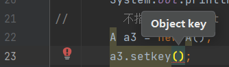
+ 在new对象时指定不同数据类型，这些对象不能相互赋值；
+ 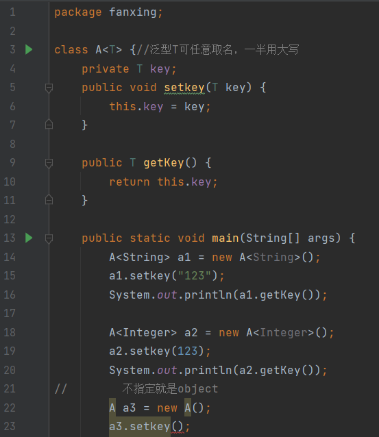

##### 泛型接口

+ 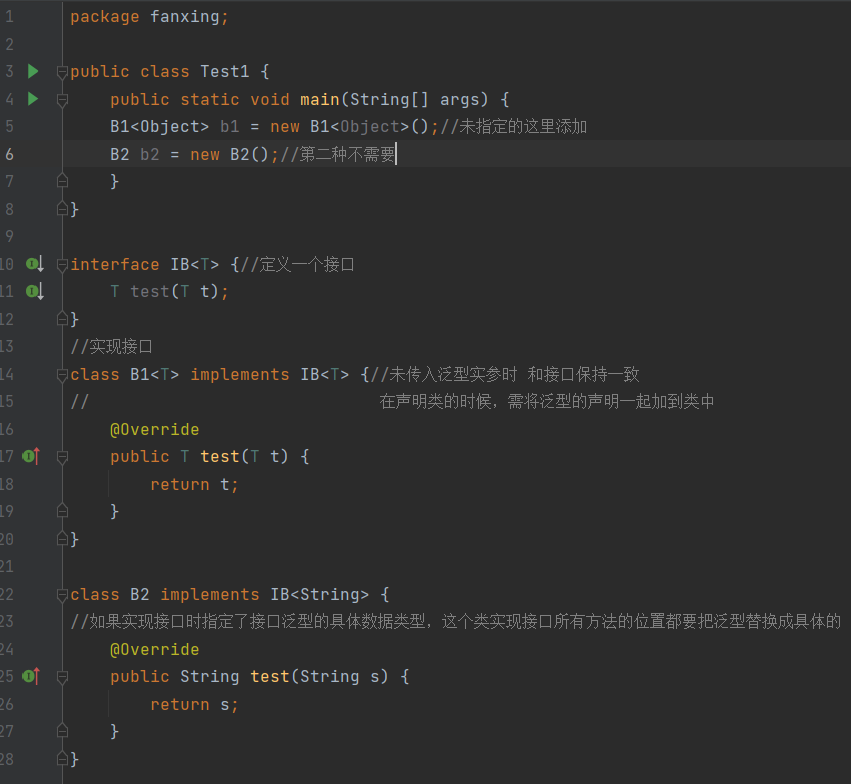

##### 泛型方法

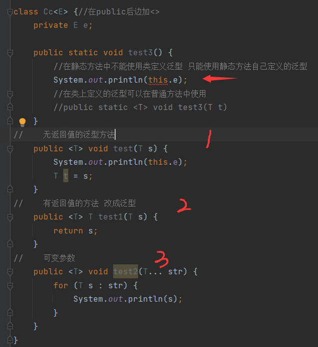

+ 泛型方法在调用之前没有固定的数据类型，在调用时才确定具体数据类型，在调用时传入的参数时什么类型就会把泛型改成该类型；

##### 泛型通配符


### io

1. java.io.File类 计算机操作系统中的文件和文件夹
2. 文件流  缓冲流
3. 转换流 标准输入输出流 打印流 数据流 对象流（把对象转化为数据流读写） 随机存取文件流
4. java\是转义符，其中\\\或/才是文件分隔符

##### File类

1. 只能操作文件本身，不能操作文件内容；需要访问文件，使用输入输出流；
2. 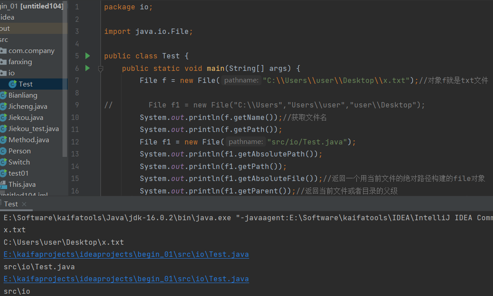


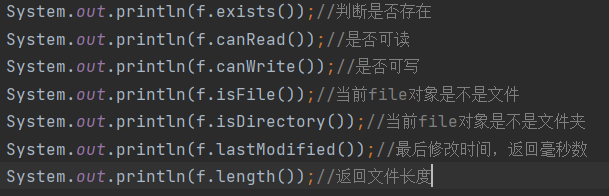

+ 新建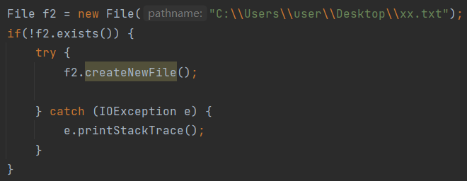
+ 创建单层目录 mkdir() 多层 mkdirs()
+ list()  返回当前文件夹的子集的名称
+ listFiles() 返回当前文件夹的自己的file对象 

##### File类遍历

##### 文件字符流

+ 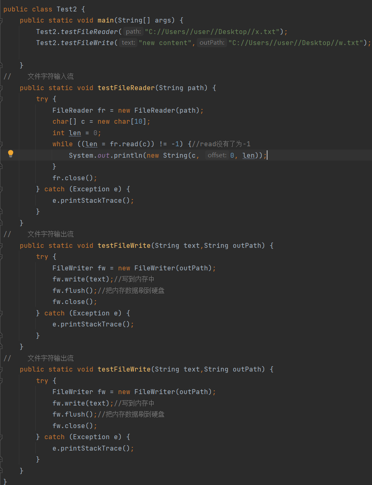

##### 缓冲流

+ 提供读写速度一定程度上绕过磁盘的限制，缓冲流基于内存的；

##### 转换流

+ 把字节流转换为字符流，当字节流中的数据全是字符的时候，使用转换流转为字符流处理效率更高


### 反射

+ 前提是jvm加载过这个类，给jvm一个类名通过反射机制能在‘记忆’（加载类的内存）中找到匹配的类的信息；

+ 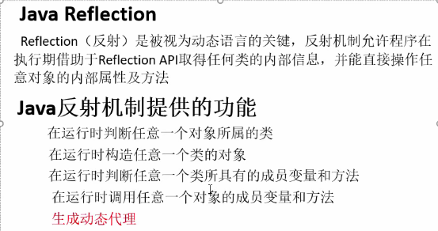

##### 主要API

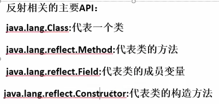

##### Class类

1. Object类中定义`public final Class getClass()`，此方法将被所有子类继承；

2. 返回值是一个Class类 是Java反射的源头 可通过对象反射求类名

3. 常用method

   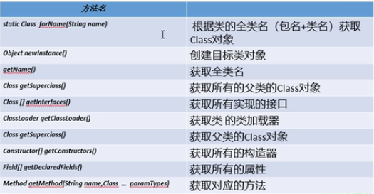


4. 创建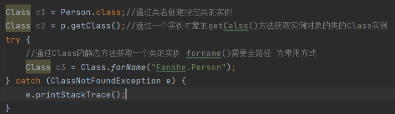

5. 反射获取父类 或接口

   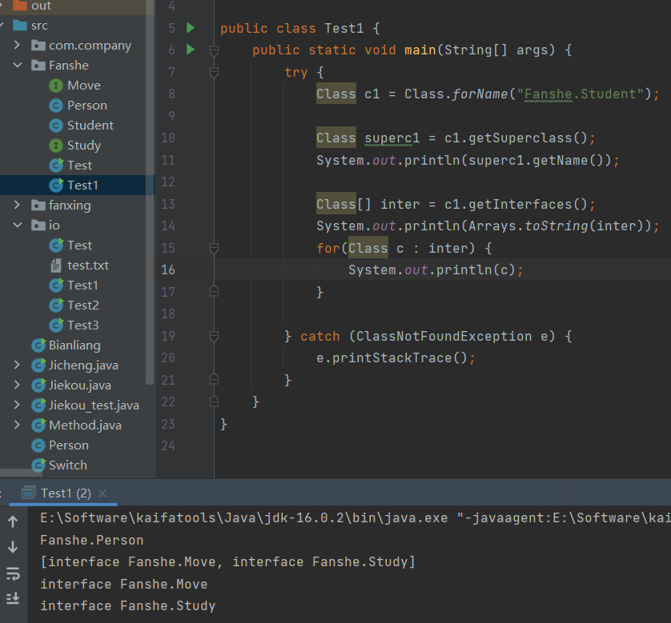

6. 获取构造器

   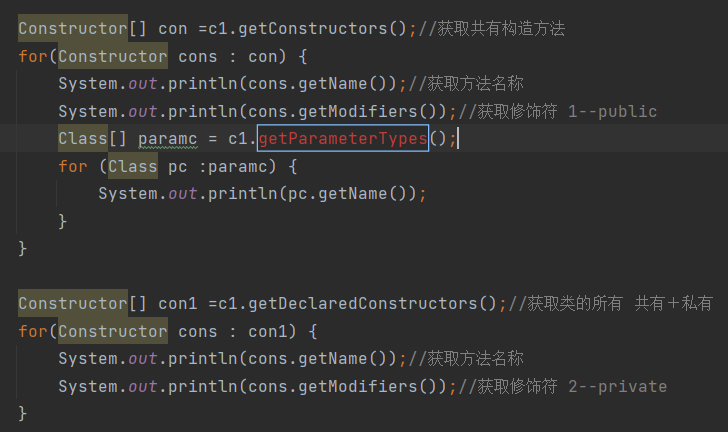

7. 通过反射创建一个对象

